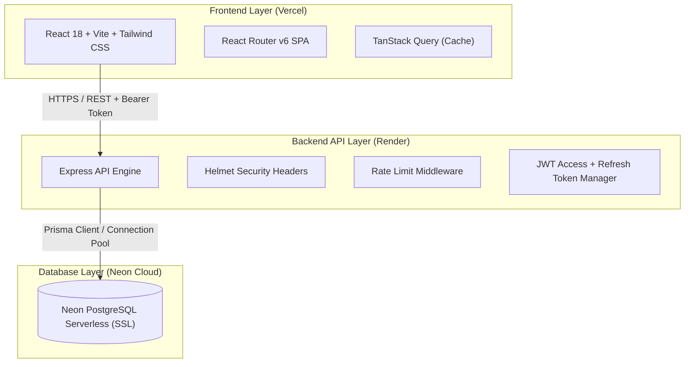

# Phase 1 — Repository Audit Report

## Executive Summary
This audit report reviews the codebase of **Sri Karthikeya Deluxe Mess - Meal Supply Management System** to prepare it for production deployment on **Vercel** (Frontend), **Render** (Backend API), and **Neon PostgreSQL** (Database).

---

## Audit Findings & Issue Matrix

| Issue ID | Severity | Root Cause | File Location | Impact | Fix Applied / Proposed |
| :--- | :--- | :--- | :--- | :--- | :--- |
| **AUD-001** | **CRITICAL** | Database provider hardcoded to SQLite (`provider = "sqlite"` & `url = "file:./dev.db"`) in `schema.prisma`. | `server/prisma/schema.prisma` | Cannot deploy to Neon PostgreSQL or cloud databases without SSL & PostgreSQL provider support. | Refactor `schema.prisma` to use `postgresql` with environment variable `DATABASE_URL`. |
| **AUD-002** | **CRITICAL** | Hardcoded fallback JWT secret (`'sri_karthikeya_mess_secret_key_2026'`) in auth middleware. | `server/src/middleware/auth.ts` | Major security vulnerability if `JWT_SECRET` is omitted from environment variables. | Require explicit `JWT_SECRET` and `JWT_REFRESH_SECRET` from environment variables, throwing runtime errors if missing. |
| **AUD-003** | **HIGH** | Absence of Refresh Token generation, rotation, and revocation endpoints. | `server/src/routes/auth.ts` | Users get logged out when 7-day token expires; no way to rotate access tokens securely. | Add `RefreshToken` schema model and `/api/auth/refresh` & `/api/auth/logout` endpoints. |
| **AUD-004** | **HIGH** | Missing environment variable configuration files (`.env.example`) for client and server. | `server/.env.example`, `client/.env.example` | Risk of failed production deployment due to missing environment bindings on Render/Vercel. | Create complete `.env.example` files for both server and client with validation. |
| **AUD-005** | **HIGH** | Missing deployment manifests for Render (`render.yaml`) and Vercel (`vercel.json`). | `render.yaml`, `client/vercel.json` | Render & Vercel builds require explicit build settings, routing fallbacks, and health checks. | Create `render.yaml` infrastructure-as-code and `vercel.json` SPA routing rewrite rules. |
| **AUD-006** | **MEDIUM** | Hardcoded API Base URL (`/api`) in frontend client without configurable environment variable (`VITE_API_BASE_URL`). | `client/src/services/api.ts` | Frontend on Vercel cannot reach external Render backend API (`https://api...onrender.com`). | Update API service to support `import.meta.env.VITE_API_BASE_URL` with CORS fallback. |
| **AUD-007** | **MEDIUM** | Missing security headers (Helmet), Rate Limiting (express-rate-limit), and strict CORS origin configuration in Express server. | `server/src/index.ts` | Backend vulnerable to brute-force login attacks, DDoS, and unauthorized origin requests. | Add `helmet`, `express-rate-limit`, and dynamic CORS origin validation. |
| **AUD-008** | **MEDIUM** | User Role Enum Gaps (Only `ADMIN` and `STAFF` existed; missing `OWNER`, `MANAGER`, `CUSTOMER`). | `server/prisma/schema.prisma` | Does not satisfy SaaS multi-role RBAC requirements. | Expand Role definitions in Prisma schema and enforce RBAC middleware. |
| **AUD-009** | **LOW** | SQLite specific schema defaults that need PostgreSQL compatibility. | `server/prisma/schema.prisma` | Data type migration warnings during `prisma db push` / `prisma migrate`. | Standardize field types (String, Float, DateTime) for PostgreSQL compatibility. |

---

## Architectural Mapping for Production

---

## Next Steps
Proceed directly to **Phase 2 & Phase 3** to execute static analysis fixes, update Prisma for Neon PostgreSQL, enforce security middleware, and generate static analysis reports.
